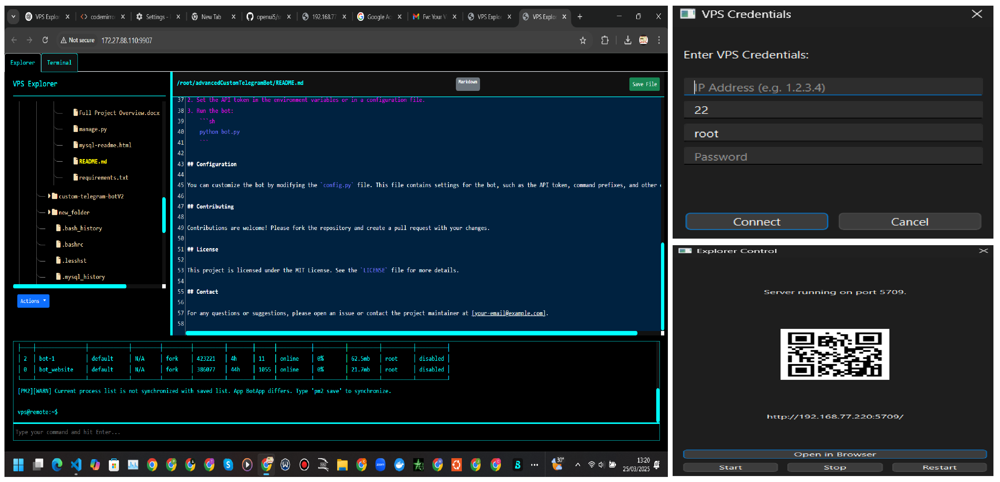

# VPS Explorer & Terminal

Welcome to **VPS Explorer & Terminal** – a dynamic, single-file remote file explorer and terminal emulator built using **PyQt6**, **Flask**, and **Paramiko**. This project is designed to give you full control over your remote VPS in a captivating, colorful, and intuitive interface that adapts to both graphical and headless (curses) environments.

---



## ✨ Overview

Imagine managing your VPS files and executing commands as if you were right in front of your server – whether through a sleek browser interface or a minimalistic terminal view in headless mode. **VPS Explorer & Terminal** brings this vision to life with:

- A **modern, dark hacker-style UI** featuring customizable panels and draggable splitters.
- A powerful **file explorer** for browsing, editing, uploading, and downloading remote files.
- An integrated **terminal emulator** that mimics the feel of a native shell.
- Intelligent handling of directory downloads by compressing folders into ZIP archives.
- A seamless fallback to a **curses-based interface** for environments without a graphical display.

---

## 🚀 Features

- **Single-file Deployment:** One Python script that combines PyQt6, Flask, and Paramiko for a hassle-free deployment.
- **Adaptive User Interface:** 
  - A vibrant, dark-themed UI with cyan accents.
  - Adjustable splitters between the file explorer and code editor, and between the terminal output and input.
  - Smooth, scrollable panels ensuring no content is ever hidden.
- **Robust File Management:** 
  - Browse remote directories with a beautifully rendered file tree.
  - Create, edit, delete, upload, and download files effortlessly.
  - Download entire directories as ZIP files for convenience.
- **Interactive Terminal Emulator:** 
  - Execute commands on your remote VPS with a realistic prompt.
  - Auto-scrolling terminal output to keep you up-to-date with command results.
- **Curses Fallback:** Automatically switches to a text-based interface in environments without a GUI.
- **Process Stability:** Enhanced process management to prevent crashes and hangs during refreshes, restarts, and server shutdowns.

---

## 🛠 Installation

### Prerequisites

- **Python 3.6+**
- Required Python packages:
  - PyQt6
  - Flask
  - Paramiko
  - Werkzeug
  - qrcode
- (Optional) For headless environments: Ensure the terminal supports Python’s `curses` module.

### Installation Steps

1. **Clone the Repository:**

   ```bash
   git clone https://github.com/yourusername/vps-explorer-terminal.git
   cd vps-explorer-terminal
```


```
pip install PyQt6 Flask Paramiko qrcode

```bash
python3 vps_explorer_terminal.py
```

## 🔍 Usage

Launch the Application:

On a graphical system, a PyQt6 login dialog appears.

In headless mode, the curses interface will be launched automatically.

## Login:

Fill in your VPS credentials. Defaults are provided (Port: 22, Username: root).

## Control Panel:

After a successful login, use the control dialog to Start, Stop, or Restart the Flask server.

A QR code and URL are displayed for quick access via your browser.

## File Explorer & Editor:

Browse your VPS directory using the interactive file tree.

Click on a file to view and edit its contents.

Use the drop-down menu for actions like creating new files/folders, uploading, or deleting items.

Adjust the panel widths using the draggable vertical splitter.

## Terminal Emulator:

Switch to the Terminal tab to execute commands on your VPS.

The terminal automatically scrolls as new output is appended.

Adjust the space allocated for terminal output with the horizontal splitter.

## 🎨 Customization
The project is designed with flexibility in mind. You can easily adjust:

- UI Colors and Themes: Edit the CSS section in the script to modify the dark theme, borders, and font styles.

- Splitter Dimensions: Tweak the draggable splitter widths and heights for a personalized layout.

- Process Management: Further customize shutdown and restart behaviors based on your server environment.

## 🤝 Contributing
Contributions are welcome! Whether you have ideas for new features, improvements, or bug fixes, feel free to open an issue or submit a pull request.

Fork the repository.

Create a new branch for your feature or bug fix.

Submit your changes via a pull request.

## 📄 License
This project is licensed under the MIT License. Feel free to use, modify, and distribute it as needed.

## 🌟 Final Thoughts
VPS Explorer & Terminal is more than just a tool—it’s an elegant solution to remote server management. Enjoy exploring your VPS with this captivating and powerful interface, and don’t hesitate to contribute your ideas to make it even better!

Happy exploring! 🚀